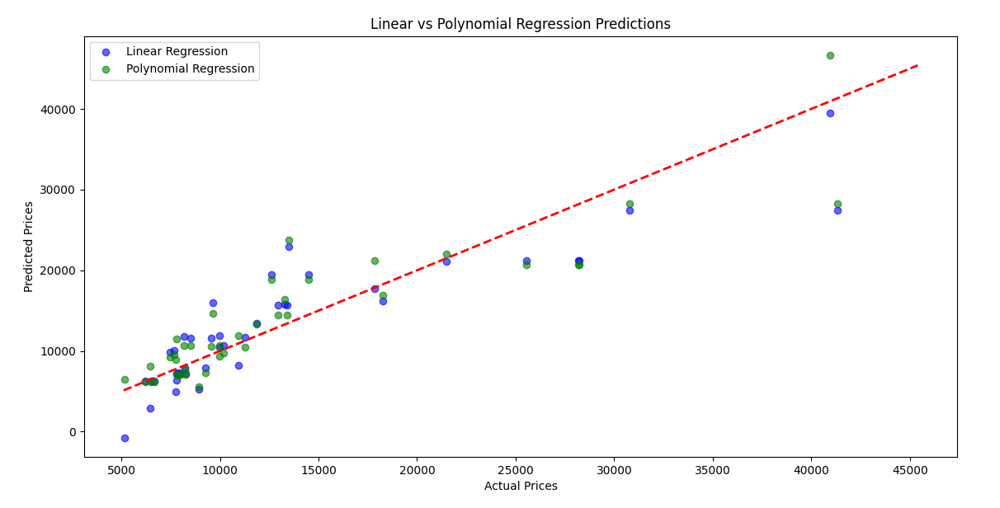

# BLENDED_LEARNING
# Implementation-of-Linear-and-Polynomial-Regression-Models-for-Predicting-Car-Prices

## AIM:
To write a program to predict car prices using Linear Regression and Polynomial Regression models.

## Equipments Required:
1. Hardware – PCs
2. Anaconda – Python 3.7 Installation / Jupyter notebook

## Algorithm
#### 1. Data Collection:
* Import necessary libraries such as pandas, numpy, sklearn, matplotlib, and seaborn.
* Load the dataset using pandas.read_csv().

#### 2. Data Preprocessing:

* Handle missing values if any.
* Select relevant features for training the models.
* Split the dataset into training and testing sets using train_test_split().

#### 3. Linear Regression:

* Initialize the Linear Regression model from sklearn.
* Train the model on the training data using .fit().
* Make predictions on the test data using .predict().
* Evaluate the model's performance using metrics such as Mean Squared Error and R^2 score.

#### 4.Polynomial Regression:

* Create polynomial features using PolynomialFeatures from sklearn.
* Fit a Linear Regression model on the transformed polynomial features.
* Make predictions and evaluate the model similar to the linear regression.

#### 5. Visualization:

* Plot the regression line for both Linear and Polynomial models.
* Visualize residuals to check model performance.
## Program:
```
/*
Program to implement Linear and Polynomial Regression models for predicting car prices.
Developed by: Vishwaraj G.
RegisterNumber: 212223220125
*/
import pandas as pd
from sklearn.model_selection import train_test_split
from sklearn.linear_model import LinearRegression
from sklearn.preprocessing import PolynomialFeatures
from sklearn.metrics import mean_squared_error, r2_score
import matplotlib.pyplot as plt

# Load the dataset
file_path = 'encoded_car_data.csv'
df = pd.read_csv(file_path)

# Select relevant features and target variable
X = df[['enginesize', 'horsepower', 'citympg', 'highwaympg']]  # Features
y = df['price']  # Target variable

# Split the dataset
X_train, X_test, y_train, y_test = train_test_split(X, y, test_size=0.2, random_state=42)

# 1. Linear Regression
linear_model = LinearRegression()
linear_model.fit(X_train, y_train)
y_pred_linear = linear_model.predict(X_test)

# Evaluate Linear Regression
print("Linear Regression:")
print("Mean Squared Error:", mean_squared_error(y_test, y_pred_linear))
print("R-squared:", r2_score(y_test, y_pred_linear))

# 2. Polynomial Regression
poly = PolynomialFeatures(degree=2)  # Change degree for higher-order polynomials
X_train_poly = poly.fit_transform(X_train)
X_test_poly = poly.transform(X_test)

poly_model = LinearRegression()
poly_model.fit(X_train_poly, y_train)
y_pred_poly = poly_model.predict(X_test_poly)

# Evaluate Polynomial Regression
print("\nPolynomial Regression:")
print("Mean Squared Error:", mean_squared_error(y_test, y_pred_poly))
print("R-squared:", r2_score(y_test, y_pred_poly))

# Visualize Results
plt.figure(figsize=(10, 5))

# Plot Linear Regression Predictions
plt.scatter(y_test, y_pred_linear, label='Linear Regression', color='blue', alpha=0.6)

# Plot Polynomial Regression Predictions
plt.scatter(y_test, y_pred_poly, label='Polynomial Regression', color='green', alpha=0.6)

plt.plot([y.min(), y.max()], [y.min(), y.max()], color='red', linestyle='--', linewidth=2)  # Ideal Line
plt.title("Linear vs Polynomial Regression Predictions")
plt.xlabel("Actual Prices")
plt.ylabel("Predicted Prices")
plt.legend()
plt.show()
```
## Output:

 
## Result:
Thus, the program to implement Linear and Polynomial Regression models for predicting car prices was written and verified using Python programming.
